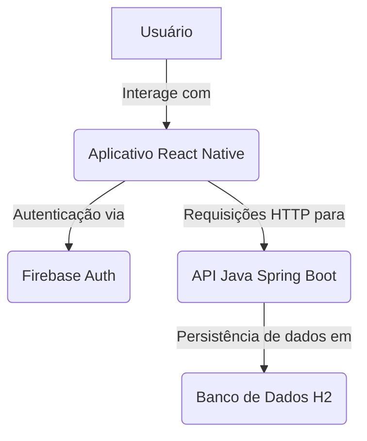

# Mottu VisionTracker

Este projeto consiste em um aplicativo móvel desenvolvido em React Native para rastreamento de motos e uma API de backend em Java com Spring Boot para gerenciar os dados das motos e alertas.

## Requisitos da Sprint 3

Esta entrega intermediária do projeto de aplicativo móvel desenvolvido em React Native visa refletir boa parte das funcionalidades planejadas, agora com uma API Java robusta no backend. O protótipo entregue anteriormente foi transformado em uma base concreta de desenvolvimento, com código limpo, integração com a API e interface minimamente refinada.

### Critérios de Avaliação e Pontuação

1.  **Telas funcionais integradas com API (40 pontos)**
    *   Implementação de funcionalidades completas utilizando a API Java.
    *   Operações CRUD (Create, Read, Update, Delete) para motos.
    *   Tratamento completo de formulários: validações, mensagens de erro, feedback ao usuário.
    *   Indicadores de carregamento em chamadas de rede.

2.  **Sistema de Login (20 pontos)**
    *   Manutenção do Firebase Authentication para o fluxo de autenticação.
    *   Validação dos formulários, tratamentos de erros e indicadores de carregamento.

3.  **Estilização com Tema (15 pontos)**
    *   Suporte a modo claro e modo escuro.
    *   Personalização visual consistente (cores, fontes, imagens).
    *   Seguindo guidelines de design (Material Design ou Apple Human Interface Guidelines).
    *   Criatividade e identidade visual coerente.

4.  **Arquitetura de Código (15 pontos)**
    *   Organização lógica de arquivos, pastas e componentes.
    *   Nomenclatura padronizada de variáveis, funções e componentes.
    *   Separação adequada de responsabilidades (componentes, serviços, estilos, rotas, contextos, etc.).
    *   Código limpo, legível e bem estruturado.
    *   Indentação correta e formatação padronizada.
    *   Uso de boas práticas específicas do desenvolvimento com React Native e Spring Boot.
    *   Utilização de ferramentas como ESLint, Prettier ou o formatador do editor.
    *   Bibliotecas utilizadas relevantes, atualizadas e necessárias.

5.  **Documentação e Apresentação (10 pontos)**
    *   Repositório contendo este arquivo `README.md` com:
        *   Nome do app
        *   Proposta e funcionalidades
        *   Estrutura de pastas
        *   Nome, RM e GitHub de todos os integrantes
    *   Gravação de vídeo demonstrando o app em funcionamento real (emulador ou dispositivo), apresentando todas as funcionalidades. (A ser gerado pelo usuário)

### Penalidades

*   Não entregar via GitHub Classroom (-20 pontos)
*   Não entregar vídeo de apresentação (-20 pontos)
*   Ausência do arquivo README.md (-10 pontos)
*   Não utilizar tema (modo claro/escuro) (-20 pontos)
*   Aplicativo fora do escopo das aulas (-60 pontos)
*   Remoção de telas entregues na Sprint anterior (-100 pontos)
*   Histórico do Git incoerente ou confuso (-50 pontos)

## Arquitetura do Projeto

O projeto agora é composto por duas partes principais:

*   **Frontend**: Aplicativo móvel desenvolvido em **React Native** com **Expo**, utilizando **Firebase Authentication** para o login.
*   **Backend**: API RESTful desenvolvida em **Java** com **Spring Boot**, utilizando **Spring Data JPA** para persistência de dados em um banco de dados **H2 em memória** (para desenvolvimento) e configurada com **CORS** para permitir comunicação com o frontend.



## Estrutura de Pastas

```
Mottu-VisionTracker2/
├── app/                     # Frontend React Native
│   ├── (auth)/              # Telas de autenticação (login, cadastro)
│   ├── (tabs)/              # Telas principais do aplicativo (motos, alertas, dashboard)
│   ├── assets/              # Imagens, ícones, fontes
│   ├── components/          # Componentes reutilizáveis da UI
│   ├── contexts/            # Contextos React (AuthContext, MotoContext, ThemeContext)
│   ├── hooks/               # Hooks personalizados
│   ├── services/            # Serviços de API (Firebase, API Java)
│   ├── types/               # Definições de tipos TypeScript
│   ├── App.tsx              # Componente raiz do aplicativo
│   ├── app.json             # Configurações do Expo
│   ├── babel.config.js      # Configuração do Babel
│   ├── tsconfig.json        # Configuração do TypeScript
│   └── package.json         # Dependências e scripts do frontend
├── backend/                 # Backend Java Spring Boot
│   └── mottu-visiontracker-api/
│       ├── src/
│   │   ├── main/
│   │   │   ├── java/com/mottu/visiontracker/
│   │   │   │   ├── config/          # Configurações (CORS, DataInitializer)
│   │   │   │   ├── controller/      # Controladores REST (MotoController, AlertaController, HealthController)
│   │   │   │   ├── dto/             # Objetos de Transferência de Dados (MotoDTO, AlertaDTO, ApiResponse)
│   │   │   │   ├── entity/          # Entidades JPA (Moto, Alerta)
│   │   │   │   ├── repository/      # Repositórios Spring Data JPA (MotoRepository, AlertaRepository)
│   │   │   │   ├── service/         # Serviços de lógica de negócio (MotoService, AlertaService)
│   │   │   │   └── MottuVisionTrackerApplication.java # Classe principal da aplicação
│   │   │   └── resources/         # Arquivos de recursos (application.properties)
│   │   └── test/                  # Testes (removido para simplificar)
│       └── pom.xml                  # Configuração do Maven
├── .gitignore               # Arquivos e pastas a serem ignorados pelo Git
└── README.md                # Este arquivo
```

## Como Executar o Projeto

### 1. Backend (API Java Spring Boot)

**Pré-requisitos:**

*   Java Development Kit (JDK) 11 ou superior
*   Apache Maven 3.6 ou superior

**Passos:**

1.  Navegue até o diretório do backend:
    ```bash
    cd Mottu-VisionTracker2/backend/mottu-visiontracker-api
    ```
2.  Compile o projeto (isso também baixará as dependências):
    ```bash
    mvn clean install
    ```
3.  Execute a aplicação Spring Boot:
    ```bash
    mvn spring-boot:run
    ```
    A API estará disponível em `http://localhost:8080/api`. O console H2 estará disponível em `http://localhost:8080/h2-console` (JDBC URL: `jdbc:h2:mem:mottu_visiontracker`).

**Endpoints da API (Exemplos):**

*   `GET /api/health` - Verifica o status da API.
*   `GET /api/motos` - Lista todas as motos.
*   `GET /api/motos/{id}` - Busca uma moto por ID.
*   `POST /api/motos` - Cria uma nova moto.
*   `PUT /api/motos/{id}` - Atualiza uma moto.
*   `DELETE /api/motos/{id}` - Remove uma moto.
*   `GET /api/alertas` - Lista todos os alertas.
*   `PATCH /api/alertas/{id}/resolve` - Resolve um alerta.
*   `GET /api/motos/stats` - Estatísticas de motos.
*   `GET /api/alertas/stats` - Estatísticas de alertas.

### 2. Frontend (Aplicativo React Native)

**Pré-requisitos:**

*   Node.js (versão LTS recomendada)
*   npm ou Yarn
*   Expo CLI (`npm install -g expo-cli`)

**Passos:**

1.  Navegue até o diretório do frontend:
    ```bash
    cd Mottu-VisionTracker2/app
    ```
2.  Instale as dependências:
    ```bash
    npm install
    # ou yarn install
    ```
3.  Inicie o servidor de desenvolvimento do Expo:
    ```bash
    expo start
    ```
4.  Use o aplicativo Expo Go no seu celular ou um emulador/simulador para escanear o QR code e abrir o aplicativo.

## Integrantes

*   **Nome:** Gusthavo Daniel
*   **RM:** [Seu RM aqui]
*   **GitHub:** [Link para seu perfil GitHub]

## Licença

Este projeto está licenciado sob a licença MIT. Veja o arquivo `LICENSE` para mais detalhes.
